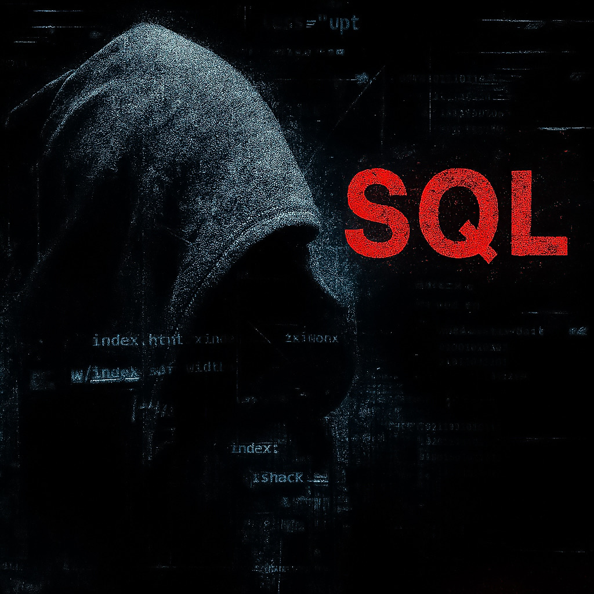
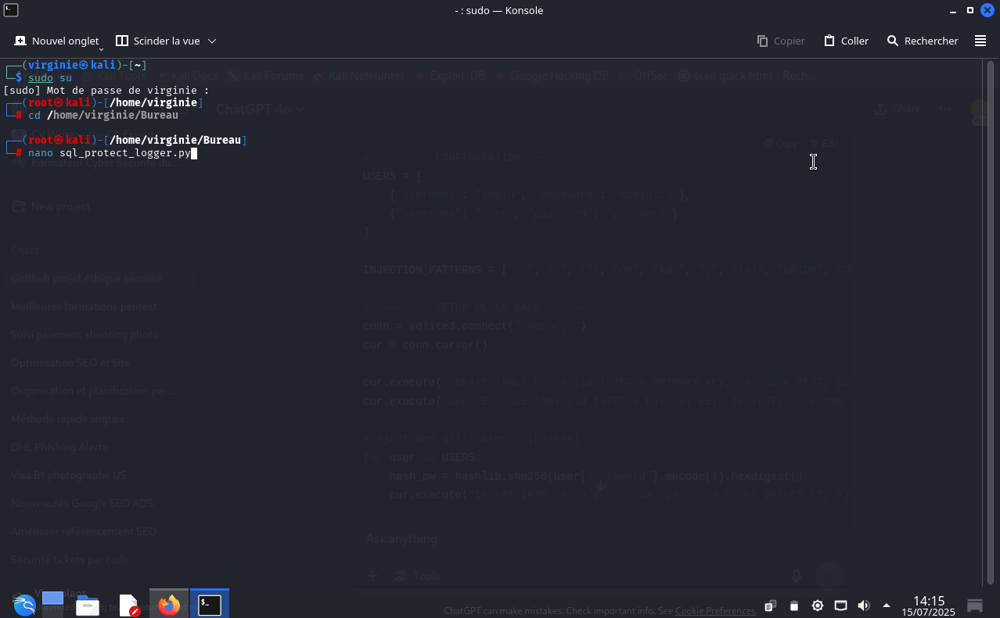
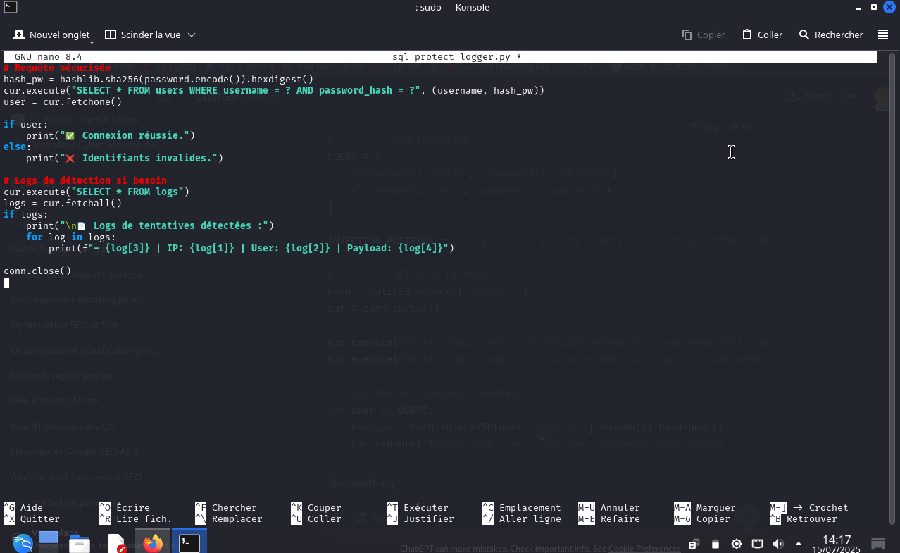
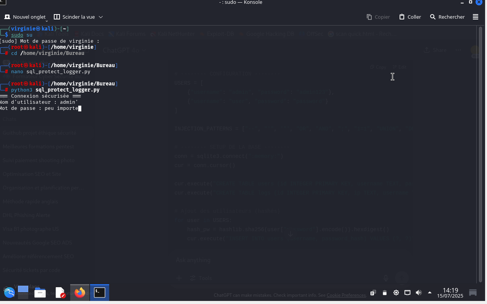
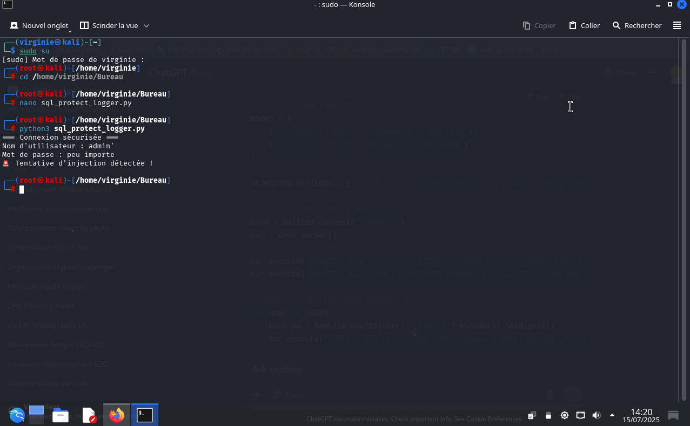

# Sensibilisation aux injections SQL, XSS, etc.

<i>Illustration d’une attaque de type SQL Injection</i>

© 2025 <strong>virg736</strong> — Tous droits réservés.
Reproduction interdite sans autorisation préalable.

📸 <strong>Image protégée</strong> — Propriété exclusive de l’auteure

---

# Sensibilisation aux Injections SQL, XSS, etc.

> Script Python pédagogique pour détecter et bloquer des tentatives d’injection.
> Exemples réels (simulés) et protections intégrées.

---

## 📑 Sommaire
- [Avertissement](#🛑-avertissement)
- [Objectif](#objectif)
- [Fonctionnement global](#fonctionnement-global)
- [Cas d’usage](#cas-dusage)
- [Exemples d’injection](#exemples-dinjection)
- [Script de protection intégré](#script-de-protection-intégré)
- [Prérequis](#prérequis)
- [Captures d’écran](#captures-décran)
- [Licence](#📄-licence)
- [À propos de l’usage](#ℹ️-à-propos-de-lusage)
- [Droits sur les visuels](#🎨-droits-sur-les-visuels)

---

## 🛑 Avertissement

Usage strictement pédagogique.
L’autrice décline toute responsabilité en cas d’usage illégal ou malveillant.

---

## Objectif

Fournir une méthode simple pour :

- Comprendre les risques liés aux injections (SQL, XSS, etc.)
- Identifier les vecteurs d’attaque classiques
- Mettre en oeuvre un script Python de protection
- Sensibiliser dans un cadre légal et sécurisé

---

## Fonctionnement global

- Le script intercepte les saisies des utilisateurs
- Il détecte les schémas malveillants (via expressions régulières et liste noire )
- Enregistre les tentatives dans une base SQLite
- Fournit un retour neutre type “Identifiants invalides”
- Ne divulgue aucune information technique en cas d’échec

---

## Cas d’usage

Ce script peut être utilisé pour :

- des démonstrations pédagogiques
- des formations en cybersécurité
- des exercices de sensibilisation
- des expérimentations en environnements fermés

---

## Exemples d’injection

🔹 **Exemple 1** :
URL avec injection SQL simulée
`https://site.com/page?id=1' OR '1'='1 --`

🔹 **Exemple 2** :
Formulaire de connexion
- Nom d'utilisateur : `admin' --`
- Mot de passe : *(vide)*

Requête générée (non sécurisée) :

sql
SELECT * FROM users WHERE username='admin' --' AND password='...';

> ⚠️ **Avertissement** :
> Ce dépôt est strictement pédagogique. Les exemples fournis sont simulés dans un environnement local.
> Toute utilisation malveillante, réelle ou non autorisée est strictement interdite.

---
## Script de protection intégré

✅ **Le script Python (fourni dans ce dépôt) :**
📁 [Voir le script principal `sql_protect_logger.py`](./sql_protect_logger.py)

- Bloque les requêtes malicieuses
- Détecte les patterns connus (`' OR 1=1`, `<script>`, `--`, etc.)
- Enregistre les tentatives (IP, horodatage, champ, valeur)
- Fournit un message neutre : “Identifiants invalides”

💡 **Le script est réel, opérationnel, basé sur des requêtes préparées SQLite.**

---

📌 Ce script n’est pas adapté à un usage en production.

En environnement réel, privilégier :

- Des frameworks sécurisés
- Des mécanismes d’authentification robustes
- Un système de journalisation centralisé
- Un IDS (Intrusion Detection System)

---

### Prérequis

- Python 3.7+
- SQLite (intégré à Python)
- Terminal ou IDE (VSCode, etc.)
- Environnement isolé ou VM recommandée

---

L’injection détectée

Le log SQLite

La réponse utilisateur

### 1. Lancement du script et détection d’injection

### 2. Terminal : saisie d’un utilisateur malveillant

### 3. Réponse neutre et détection affichée

### 4. Logs des tentatives enregistrés en base

---

📄 Licence

Le script est publié sous la licence MIT.

---

ℹ️ À propos de l’usage

Ce projet est destiné exclusivement à des fins pédagogiques :

Formations en cybersécurité

Tests d’intrusion légaux (pentests)

Analyse ou audit en environnement contrôlé

L’autrice ne cautionne ni n’autorise l’usage en dehors d’un cadre légal strictement défini.

Toute utilisation non conforme est interdite et relève de la responsabilité exclusive de l’utilisateur.

---

🎨 Droits sur les visuels

Les visuels, illustrations ou captures présents dans ce dépôt sont la propriété exclusive de l’autrice.

Toute reproduction ou réutilisation sans autorisation préalable est interdite.

© 2025 Virginie Lechene – Tous droits réservés.
